<!-- ========================================================= -->
<!--                         HERO                              -->
<!-- ========================================================= -->

  

<h1 align="center">🚩 Jai Shree Ram 🚩</h1>

<h2 align="center">Hi, I'm <strong>Vansh Gupta</strong> 👋</h2>

  <strong>Full Stack Engineer · Problem Solver · System Design Enthusiast</strong>

  

  
  
  

---

<!-- ========================================================= -->
<!--                       ABOUT ME                            -->
<!-- ========================================================= -->

## 🚀 About Me

I'm a **Full Stack Engineer** focused on building **scalable, maintainable, reliable, and performance-driven systems**. I enjoy working across the stack — from frontend interfaces and backend services to APIs, databases, cloud infrastructure, and distributed systems.

 

<table width="100%" border="0" cellpadding="0" cellspacing="0">
  <tr>
    <td width="60%" valign="top">
      <h3>🎯 Engineering Focus</h3>
      <ul>
        <li>🏗️ <strong>Scalable Software Architecture</strong></li>
        <li>⚙️ <strong>Production-Ready Applications</strong></li>
        <li>🧠 <strong>DSA & Problem Solving</strong></li>
        <li>🌐 <strong>System Design & Distributed Systems</strong></li>
        <li>☁️ <strong>Cloud & DevOps</strong></li>
        <li>🔍 <strong>Engineering Fundamentals</strong></li>
        <li>🚀 <strong>Performance & Reliability</strong></li>
      </ul>
    </td>
    <td width="60%" align="center" valign="middle">
      
    </td>
  </tr>
</table>

---

<!-- ========================================================= -->
<!--                    TECHNICAL STACK                       -->
<!-- ========================================================= -->

## 🛠️ Technical Stack

### 💻 Languages

  
  
  
  

### 🎨 Frontend

  
  
  

### ⚙️ Backend & APIs

  
  
  
  

### 🗄️ Database & Infrastructure

  
  
  
  
  
  

---

<!-- ========================================================= -->
<!--                    GITHUB ANALYTICS                      -->
<!-- ========================================================= -->

## 📊 GitHub Analytics

  
  

---

<!-- ========================================================= -->
<!--                  DEVELOPER THOUGHT                        -->
<!-- ========================================================= -->

## 💭 Developer Thought

  

---

<!-- ========================================================= -->
<!--                       CONNECT                             -->
<!-- ========================================================= -->

## 🤝 Let's Connect

  
  
  

  

  <i>✨ Building with discipline · Learning with curiosity · Engineering for the long term ✨</i>

